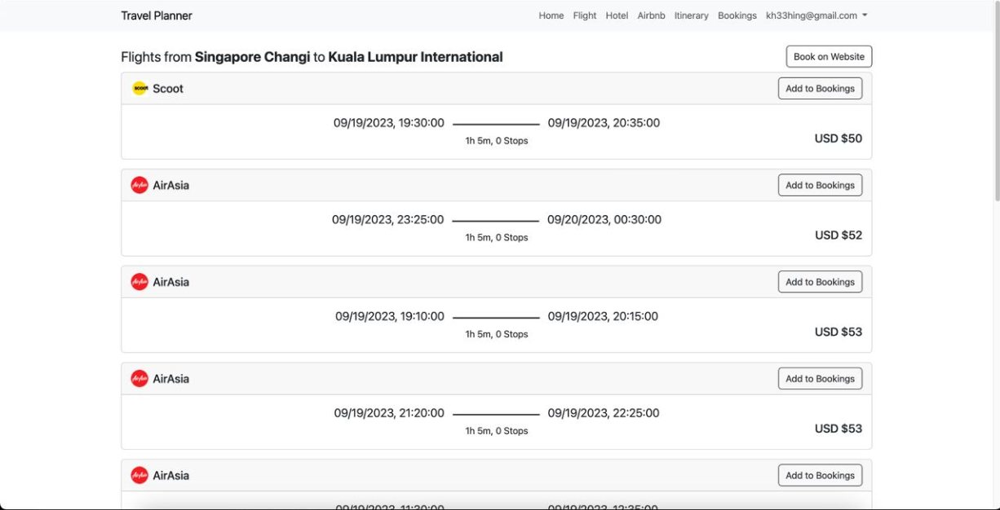
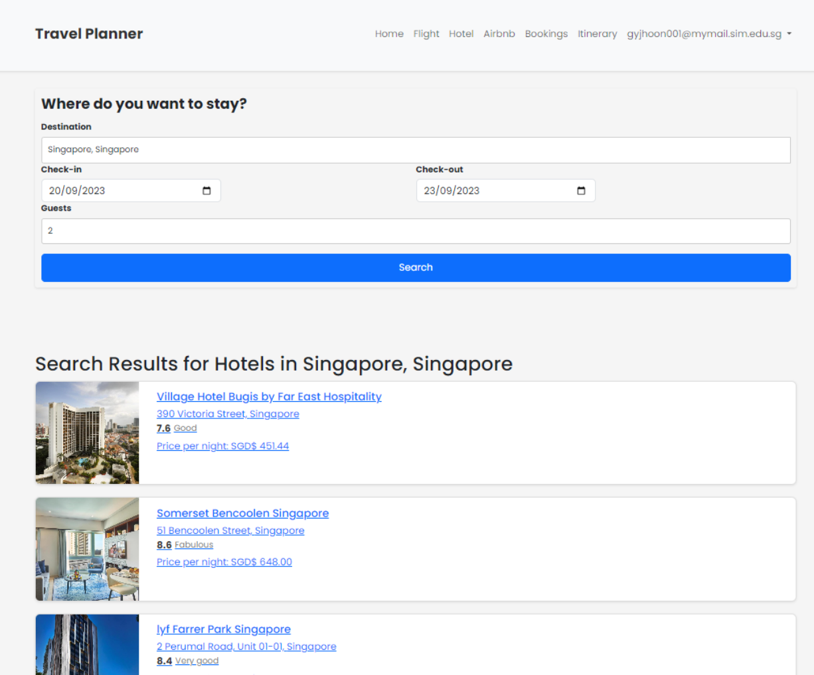
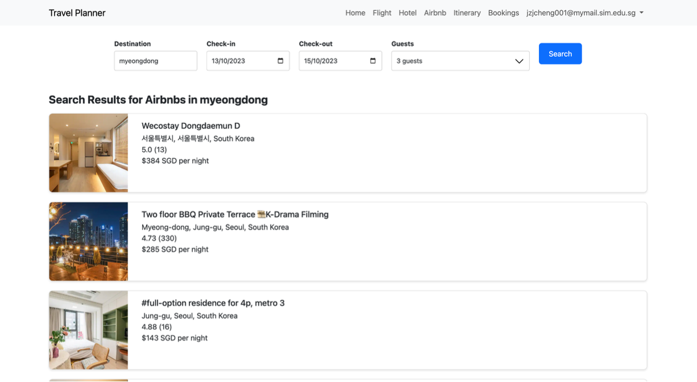
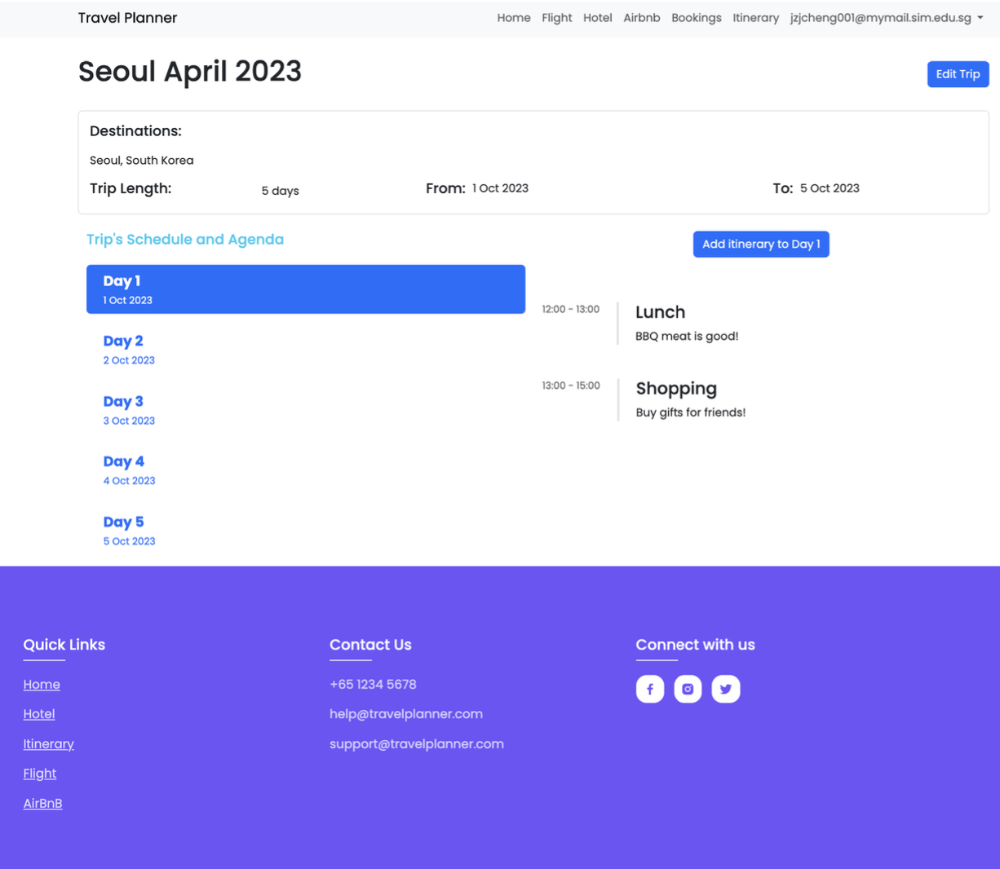

# Travel Planner

## About

This application is an all-in-one travel planning website developed in Node.js using Firestore Database. It allows users to book flights, hotels, airbnbs and plan their itineraries all within the same platform. It uses real data by integrating with various APIs from Skyscanner, Booking.com and Airbnb.

Note: This application cannot be run anymore as the API subscriptions have been terminated.

## Flight Results Page

## Hotel Results Page

## Hotel Info Page

## Airbnb Results Page

## Airbnb Info Page

## Itinerary Page

